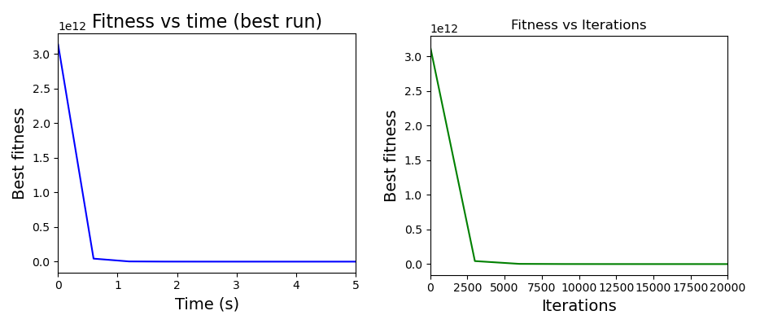

# F3: Shifted Rosenbrock's Function

![$F_3(X) = \sum_{i=1}^{D-1} (100(z_i^2 - z_{i+1})^2 + (z_i - 1)^2) + f\_bias_3 \ , Z = X-O+1 \ , X=\[x_1,x_2,...,x_D\]$](https://render.githubusercontent.com/render/math?math=%24F_3(X)%20%3D%20%5Csum_%7Bi%3D1%7D%5E%7BD-1%7D%20(100(z_i%5E2%20-%20z_%7Bi%2B1%7D)%5E2%20%2B%20(z_i%20-%201)%5E2)%20%2B%20f%5C_bias_3%20%5C%20%2C%20Z%20%3D%20X-O%2B1%20%5C%20%2C%20X%3D%5Bx_1%2Cx_2%2C...%2Cx_D%5D%24)

![$O=\[o_1, o_2,...,o_D\]$](https://render.githubusercontent.com/render/math?math=%24O%3D%5Bo_1%2C%20o_2%2C...%2Co_D%5D%24) : the shifted global optimum

The optimum of the solution is calculated for dimensions 50 and 500 with a boundary limit of ![$X \in \[-100,100\]^D$](https://render.githubusercontent.com/render/math?math=%24X%20%5Cin%20%5B-100%2C100%5D%5ED%24)

Global optimum: %20%3D%20f%5C_bias_3%20%3D%20390%24)

## Chosen algorithm

The optimum was found using **Simulated Anealing**.

*Code Here* : [ShiftedRosenbrock.py](https://github.com/Jasmy118/Metaheuristic-Optimization/tree/master/Continuous%20Optimization%20Problems/F3%20:%20Shifted%20Rosenbrock%E2%80%99s%20Function/ShiftedRosenbrock.py)

### Convergence curves of different algorithms in 20D

## Parameters of the algorithm
For 50 dimension,
- Ts: starting temperature = 50
- Tf: final temperature = 0.001
- n_T_adj: number of temperature adjustments in the annealing schedule = 25
- n_range_adj: number of adjustments of the search range performed at a constant temperature = 25
- bin_size: number of mutations that are used to compute the acceptance rate = 25
- population size is given 500

For 500 dimension,
- Ts: starting temperature = 50
- Tf: final temperature = 1e-4
- n_T_adj: number of temperature adjustments in the annealing schedule = 90
- n_range_adj: number of adjustments of the search range performed at a constant temperature = 90
- bin_size: number of mutations that are used to compute the acceptance rate = 30
- population size is given 700

## Results
The outputs and epochs using SEA algorithm in 50 and 500 dimension can be found in below link:

[SA_Output_50](https://github.com/Jasmy118/Metaheuristic-Optimization/blob/master/Continuous%20Optimization%20Problems/F3%20:%20Shifted%20Rosenbrock%E2%80%99s%20Function/Outputs/sa_output_50a.txt)  ||  [SA_Epochs_50](https://github.com/Jasmy118/Metaheuristic-Optimization/blob/master/Continuous%20Optimization%20Problems/F3%20:%20Shifted%20Rosenbrock%E2%80%99s%20Function/Outputs/sa_epochs_50a.txt)

[SA_Output_500](https://github.com/Jasmy118/Metaheuristic-Optimization/blob/master/Continuous%20Optimization%20Problems/F3%20:%20Shifted%20Rosenbrock%E2%80%99s%20Function/Outputs/sa_output_500a.txt)  ||  [SA_Epochs_500](https://github.com/Jasmy118/Metaheuristic-Optimization/blob/master/Continuous%20Optimization%20Problems/F3%20:%20Shifted%20Rosenbrock%E2%80%99s%20Function/Outputs/sa_epochs_500a.txt)

The details of the results are as below:

### Simulated Annealing 50D
Time taken to compute the optimum :  81.72 seconds (1.36 minutes)

Optimum value of function :  390.02198492

Optimum values of x : 

[-75.42790926 -35.73182377 -57.59405554  38.91065678  52.24774576
 -30.36013563  50.68988816  49.79837063 -71.1566303  -30.78469228
 -43.00316824 -20.08927739  71.52786727  48.02111707 -46.02690074
  -8.16198927 -40.9754565  -13.82738386  35.81733882  57.13766226
  58.58502002 -17.41084431  27.28886252 -62.56185863 -28.81562275
 -86.52951778  48.29080879  -7.58302042 -82.16057668 -72.0786424
  82.24547444  19.5852986  -45.58750123  77.31216372 -12.61474795
 -81.18361479  72.87783914  86.08196757  28.40088138  40.85332065
  -2.04468419  33.44173801 -24.67062804 -17.82227952   2.57893471
 -81.81750649  88.42880812 -34.30101687 -43.89633681  19.69992482]

Problem details :  Problem name: RosenBrock
	C++ class name: class pybind11::object

	Global dimension:			50
	Integer dimension:			0
	Fitness dimension:			1
	Number of objectives:			1
	Equality constraints dimension:		0
	Inequality constraints dimension:	0
	Lower bounds: [-100, -100, -100, -100, -100, ... ]
	Upper bounds: [100, 100, 100, 100, 100, ... ]
	Has batch fitness evaluation: false

	Has gradient: false
	User implemented gradient sparsity: false
	Has hessians: false
	User implemented hessians sparsity: false

	Fitness evaluations: 781750

	Thread safety: none
    
### Simulated Annealing 500D
Time taken to compute the optimum :  24144.07 seconds (6.7 hours)

Optimum value of function :  390.02274987

Optimum values of x :

[-75.42703341 -35.7319016  -57.59574956  38.90961793  52.2473033
 -30.36133567  50.69054724  49.79903634 -71.15533929 -30.78370969
 -43.00138366 -20.08863755  71.52730117  48.01987245 -46.02778365
  -8.16365651 -40.9759896  -13.82784946  35.81589509  57.13702532
  58.58464147 -17.41272344  27.28759218 -62.56290872 -28.81766194
 -86.52908361  48.29224651  -7.58200741 -82.1597708  -72.07887515
  82.24627996  19.58458527 -45.58562806  77.3141052  -12.61300776
 -81.18469555  72.87795368  86.08246046  28.40088327  40.8535734
  -2.04688422  33.44104713 -24.67027747 -17.82025049   2.58405943
 -81.80699642  88.44550822 -34.27000168 -43.83496172  19.81882442
  -9.54274058 -14.68067847 -15.86881969  38.53004627 -71.50056818
 -21.56847779  45.44171604 -63.14867655  28.95911655 -47.35006113
  40.97060503 -43.46356684  -5.48812163  64.35209803  60.01464371
  -4.32440322 -28.77592323   7.59867399  11.07000843  76.53886784
 -40.60947027 -36.78431255  20.25826168  70.3151538   38.60058757
 -53.72959588 -70.5296447   42.84619993  47.16391969 -39.78417424
  62.13933698  22.39007208  21.90115883  81.88141986 -36.82508225
  23.72833738   5.63293068  66.80957233  15.20266455  18.47427386
  -2.13296225  79.67669344 -27.62496158 -54.05612865 -72.34171249
  27.38154761  19.07376986  55.99373489  -6.88437131 -73.13127376
 -71.51519394  67.4175696  -79.06438338  62.50232327  -8.26071368
 -45.32846183  87.94440874  11.57703281 -50.30479493  67.95155656
  40.96108546  63.55487427 -58.01829472   7.2543681   -5.00685451
  41.83107155  86.50711868  30.02759598  32.96409049  67.57144649
   1.38449042  -5.77903366 -45.92777038  11.88503102  46.93015378
 -27.86954833  -9.44185091   2.84190637 -61.67768461  86.55851132
 -36.22381082 -62.17168272  78.43316526  31.29499282 -12.97587482
  59.90574911 -59.16146377 -10.68405606  45.43926818  20.78912668
 -44.24965893 -26.92732348  20.34220495 -29.20991049  24.47816309
   2.98836797   3.51656308  22.76087585  80.8541388  -49.77295686
  89.03561608  67.93305398  22.67047408 -51.86143043  74.79782157
 -65.83458834  84.25219457  21.58332932  25.33921737 -87.55698706
  52.1162084   71.92075666 -89.60706315   2.94035785  22.39676552
 -42.26614688 -18.18258852  85.97378439 -35.33193837  12.01609651
 -51.09809788 -65.62676173  86.15208494 -51.4202891  -65.55816459
 -80.52024628 -42.36398995  46.31807314 -11.57510401   1.19881355
  -0.94995731 -73.0422038   84.81797053 -13.51807041 -41.36491174
  78.34483575 -50.26486502 -55.86812406 -39.49242535  31.3309144
  17.67724221 -20.007367    78.45207088  58.84949853 -80.76982516
  58.98644116 -20.19469234  -9.76760591 -88.34936287 -39.56650547
 -37.43694548 -12.61957846  36.24133536 -88.13551521 -47.34119411
 -17.73430506 -74.21547388  69.03847202 -11.42651658 -34.41730672
  58.36703254  33.74978599   5.47537812 -58.03346561  71.46295293
  55.79452988 -19.95633588  -3.78006207  19.33253556  27.34304571
  47.25460465  -9.41231381  25.73697515 -39.49486304 -10.2084891
 -45.32302096 -62.70822261 -52.82449193  74.54947872  14.86991629
  34.79455569  64.16823711  -2.43510641 -28.30926612 -14.6442588
 -68.63178113   3.34149319  84.88438275 -30.76723012 -28.94973927
  54.33751912 -61.25370108 -61.33578214 -60.5403767   74.58276086
  49.50304322 -12.62085923 -43.35286322  22.02892693  87.34453301
  24.64721189 -48.04831176  51.20994665 -89.38724411  53.53374487
 -52.62210078 -54.0848077   85.96385064  22.1524845  -80.0615548
 -64.38659851 -16.5887139   50.0673801  -60.70177822 -85.28246456
  63.24411038 -44.47303848 -18.87201454  33.71176623  66.77798053
  32.57721246 -64.94390644  13.85802755  33.19440213 -33.08475394
   2.12947962  -9.70182951   3.63286046 -24.1144736   27.41516229
  66.88022617  66.23470303   5.36441546  82.67603363  16.38250413
 -85.80383462 -57.19821529  -5.85557275  20.4158791  -64.86166236
 -51.88074266  88.21242776 -30.59305706 -13.34973968 -63.6741883
   8.23212361 -73.44353376 -11.70746729 -74.93730648   9.8847319
 -86.79088278  25.93869903 -19.39195944 -31.20510942 -42.33279471
   1.85004749  -8.00815773  55.86739216  -5.88200819   3.3305793
 -53.44452978  14.51662004  17.58619227  28.18236618  14.66638191
  47.49163427 -60.55986308  61.15482669  89.33701724  28.82398981
 -67.81492398  15.68434798 -63.67737045  80.94970145  43.55598028
  67.06915476 -60.37383914  -4.71877948 -27.60584538 -36.33894556
 -82.76746164 -21.31196789 -66.25184947 -64.26275145 -21.24849192
  24.6260101   50.46147492 -12.98406016 -59.17546982 -23.99603096
  86.0071166   -7.3255223   67.34464617 -62.62492439 -10.35811253
  75.74245953  86.47035019  -6.56208309 -27.99164355 -52.29993812
 -33.08026685  71.61189712 -77.28442256 -45.37312021 -86.42503491
  89.4347025  -71.97683687  75.39434539 -65.87865223 -53.09111454
 -60.45237865  49.86967062  10.82579969  29.7205603   67.24230379
  19.77001935  78.99176582 -38.59654208  47.68190709 -63.12046265
  21.48794787  22.17665863  55.50342654 -32.78567247 -27.25523694
 -44.35668264  75.86928255  36.62754116  37.12080424 -62.88905138
  36.6720869  -76.71671465 -80.54551754   4.25318079  26.91889469
 -47.99056048 -64.77554172 -47.23452211  67.35120126  64.93219397
  27.28990172  67.34558905  83.46324441  80.38076338  69.53977256
   6.7824504   56.37058219 -46.34952162 -24.48901344  31.95640694
 -54.52529623 -54.98802387   9.06903767 -86.69069226 -61.0171008
   6.33039037 -12.9405056  -16.72364521  59.8081106  -55.31404877
  32.38800748  75.29749096 -81.68495537  68.55380671 -13.97125099
  -7.97627207  21.13027908  43.68756649  89.27800367  77.03020308
 -86.55967768 -21.37831529  28.25930854 -84.92021572  20.07505128
   4.30928777  22.12751549 -64.89984158  -8.77597202 -16.35003086
  73.60835066 -17.79591925 -55.66778454  56.9895364  -13.94091733
 -20.55788094  38.89539472  18.94797973 -75.27346052 -66.52635733
 -23.78307397  10.81066856  43.23341949  86.8413615   -2.55974309
 -89.92946473  50.69860987 -27.50964658 -36.74016021  59.67525813
 -72.36840784 -22.70864441  25.24782976 -83.86629026 -32.51036914
  83.09783609  29.95114435 -74.43118103 -43.99800718 -64.30670787
 -40.08821676  49.75986863  37.43717912  18.52679699 -82.90379342
  62.22250439 -48.64642055  -0.88836663 -84.58835378  26.63018328
 -17.92003968  48.15307022 -20.90397192  70.45435806 -16.59738667
 -22.17018671 -74.07881892  86.86371993  75.90534326  -6.8568975
  11.06485011  -1.18934606  88.91619752 -85.37821247 -43.28690883
 -31.11139514 -67.88258025  44.26793317  23.28561887 -54.61321871
  -6.5214607  -42.1282101  -89.34828447 -69.16426687  10.60486405
  70.60842972  72.21673393  35.97824982 -47.92186568   5.30691393]

Problem details :  Problem name: RosenBrock
	C++ class name: class pybind11::object

	Global dimension:			500
	Integer dimension:			0
	Fitness dimension:			1
	Number of objectives:			1
	Equality constraints dimension:		0
	Inequality constraints dimension:	0
	Lower bounds: [-100, -100, -100, -100, -100, ... ]
	Upper bounds: [100, 100, 100, 100, 100, ... ]
	Has batch fitness evaluation: false

	Has gradient: false
	User implemented gradient sparsity: false
	Has hessians: false
	User implemented hessians sparsity: false

	Fitness evaluations: 121500700

	Thread safety: none

## Number of function evaluations
781750 function evaluations (Fevals) are done in 50 D 121500700 in 500 D.

## Computational time
Time taken to compute the optimum in 50 dimension :  81.72 seconds (1.36 minutes)

Time taken to compute the optimum in 500 dimension :  24144.07 seconds (6.7 hours)

## Convergence curve

### Simulated Annealing 50D

### Simulated Annealing 500D

