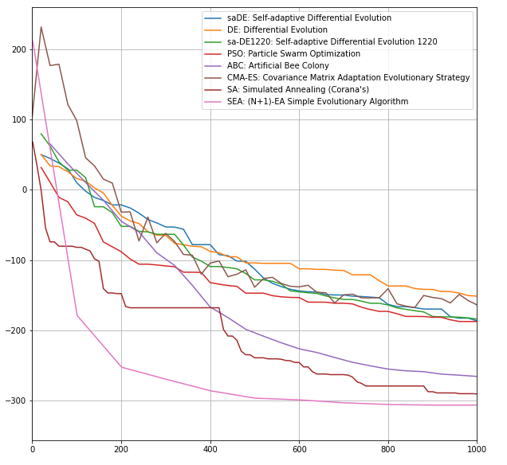

# F4: Shifted Rastrigin's Function

![$F_4(X) = \sum_{i=1}^{D} (z_i^2 - 10 \cos(2\pi z_i) + 10) + f\_bias_4 \ , Z = X-O \ , X=\[x_1,x_2,...,x_D\]$](https://render.githubusercontent.com/render/math?math=%24F_4(X)%20%3D%20%5Csum_%7Bi%3D1%7D%5E%7BD%7D%20(z_i%5E2%20-%2010%20%5Ccos(2%5Cpi%20z_i)%20%2B%2010)%20%2B%20f%5C_bias_4%20%5C%20%2C%20Z%20%3D%20X-O%20%5C%20%2C%20X%3D%5Bx_1%2Cx_2%2C...%2Cx_D%5D%24)

![$O=\[o_1, o_2,...,o_D\]$](https://render.githubusercontent.com/render/math?math=%24O%3D%5Bo_1%2C%20o_2%2C...%2Co_D%5D%24) : the shifted global optimum

The optimum of the solution is calculated for dimensions 50 and 500 with a boundary limit of ![$X \in \[-5,5\]^D$](https://render.githubusercontent.com/render/math?math=%24X%20%5Cin%20%5B-5%2C5%5D%5ED%24)

Global optimum: %20%3D%20f%5C_bias_4%20%3D%20-%20330%24)

$O=[o_1, o_2,...,o_D]$ : the shifted global optimum

The optimum of the solution is calculated for dimensions 50 and 500 with a boundary limit of $X \in [-5,5]^D$

Global optimum: $X^* = O , F_4(X^*) = f\_bias_4 = -330$

## Chosen algorithm

The optimum was found using **(N+1)-EA Evol. Algorithm (SEA)** - simple evolutionary algorithm.

https://esa.github.io/pagmo2/docs/cpp/algorithms/sea.html

### Convergence curves of different algorithms in 20D

